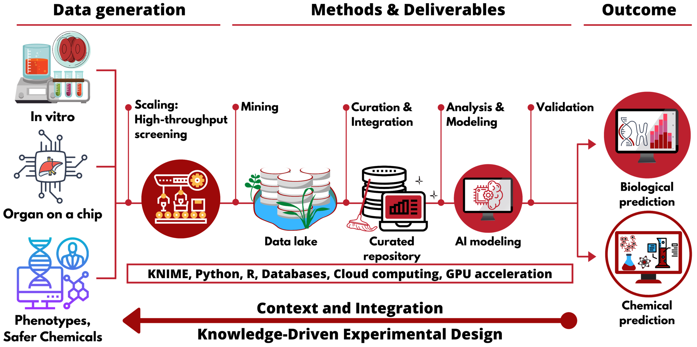

# Curated data in – trustworthy <i>in silico</i> models out: the impact of data quality on the reliability of artificial intelligence models as alternatives to animal testing

  
 

New Approach Methodologies (NAMs) that employ artificial intelligence (AI) for predicting adverse effects of chemicals have generated optimistic expectations as alternatives to animal testing. However, the major underappreciated challenge in developing robust and predictive AI models is the impact of the quality of the input data on the model accuracy. Indeed, poor data reproducibility and quality have been frequently cited as the cause of the crisis in biomedical research, including toxicology and chemistry.

Here we provide two case studies demonstrating the effect of data curation on the performance of AI models for predicting skin sensitization and skin irritation. As once can see on the table below, models generated with uncurated data had a 7-24% higher correct classification rate (CCR). The perceived performance was, in fact, inflated owing to the high number of duplicates in the training set. We assert that data curation is a critical step in building computational models to assure reliable predictions of chemical toxicity. Obviously, the statistics of the models generated with the uncurated set are deceiving and the use of these models could lead to making, effectively, irrational decisions.

## Characteristics of QSAR models
### Skin sensitization

|     Model                 |     CCR     |     Sensitivity    |     PPV     |     Specificity    |     NPV     |
|---------------------------|-------------|--------------------|-------------|--------------------|-------------|
|     Uncurated data set    |     0.75    |     0.72           |     0.76    |     0.77           |     0.74    |
|     Curated data set      |     0.68    |     0.74           |     0.66    |     0.61           |     0.71    |
### Skin irritation
|     Model                 |     CCR     |     Sensitivity    |     PPV     |     Specificity    |     NPV     |
|---------------------------|-------------|--------------------|-------------|--------------------|-------------|
|     Uncurated data set    |     0.87    |     0.94           |     0.92    |     0.79           |     0.84    |
|     Curated data set      |     0.63    |     0.54           |     0.66    |     0.72           |     0.61    |

## More information
For more information, please refer to our paper:
Alves, V. M.; Auerbach, S. S.; Kleinstreuer, N.; Rooney, J. P.; Muratov, E. N.; Rusyn, I.; Tropsha, A.; Schmitt, C. Curated Data in – Trustworthy in Silico Models out: The Impact of Data Quality on the Reliability of Artificial Intelligence Models as Alternatives to Animal Testing. ATLA Altern. to Lab. Anim. **2021**, *Submitted.*
